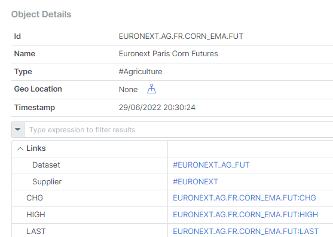
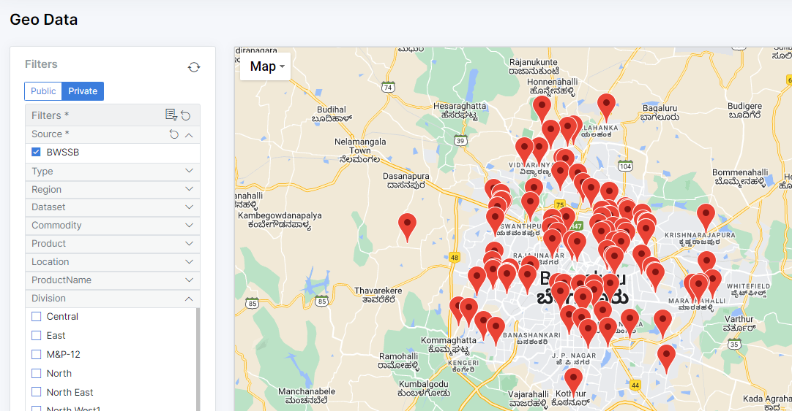

<div className="row">
  <div className="column">
    
  </div>
  <div className="column">
  <h2>Building applications using MongoDB?</h2>  
    Explore how OpenDataDSL makes it easy to build and manage applications using MongoDB Atlas.
  </div>
</div>

<!--truncate-->

## Introduction
MongoDB is by far the most popular document database and with their cloud Atlas offering, they provide the best Document DAAS (Database As A Service) offering around.

OpenDataDSL uses MongoDB Atlas for storage of all the resources and is an easy programming language for managing data.

:::info Turbocharge your development
If you are building applications using MongoDB,
take a look at how OpenDataDSL can accelerate your time-to-market by providing many of the features you need out-of-the-box.
:::

## What you get out-of-the-box

### User Interfaces
* A user-friendly web portal which you can whitelabel to make it your own.
* An Excel Add-In to read and write MongoDB data using Excel.
* Development environment in Microsoft VSCode for easy coding using our DSL (4GL language) 

### Data management programming language
A simple basic-like language with data management specific syntax.

An example of finding some data in the object collection filtering on a property called source.

```js
objects = find top 15 ${object} where source="EURONEXT"

for o in objects
    print o.id + " " + o.dataset
next
```

### Inter-document relationships
Create 'links' to other documents which improve your users' navigation ability.


### Geo-spatial data
Include geo-spatial information points, polygons and lines) in your documents to build a filterable map.


### Document versioning
Never lose any data with built-in, automatic versioning of documents, data and entities.

### Automatic filtering
Define which fields in your documents are 'dimensions' that you want to filter on in the Web Portal

### Comprehensive ETL
Use our world-class ETL components to extract data from anywhere, transform it into your data model and load it into MongoDB.

### Built-in Timeseries, Curves and Events
Robust management of Timeseries, Curve and Event data.
Convert discrete events into Timeseries and curves.

### Smart Data
Create formulas and expressions that dynamically enhance your 'raw' Timeseries, Curves and Events

### Built-in conversions
Easily convert values to different currencies and units on-the-fly with the built-in conversion intelligence. 

### Workflows, actions and processes
Build comprehensive workflows with your own custom actions to load or process data.
Run scheduled or event-driven processes 

### Multiple environments
Get access to multiple data environments for feature development, data previewing etc.
Improve data releases by pre-staging data and 'merging' to production when ready. 

### Message queues
Integrate your MongoDB data with your internal systems using message queues.
Subscribe to data changes and push data to queues to be consumed by your internal systems.

### Auditing
Comprehensive audit logs to identify changes and user activity 

## Further Reading
* [What is OpenDataDSL?](/docs/product/intro)
* [VSCode extension](/docs/user/vscode)
* [Coding in ODSL](/docs/odsl)