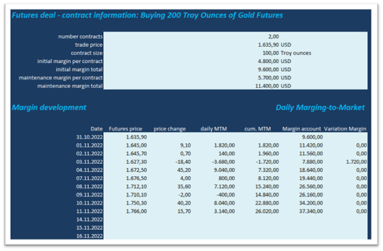
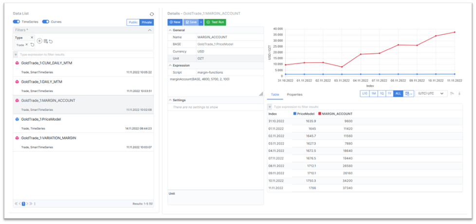
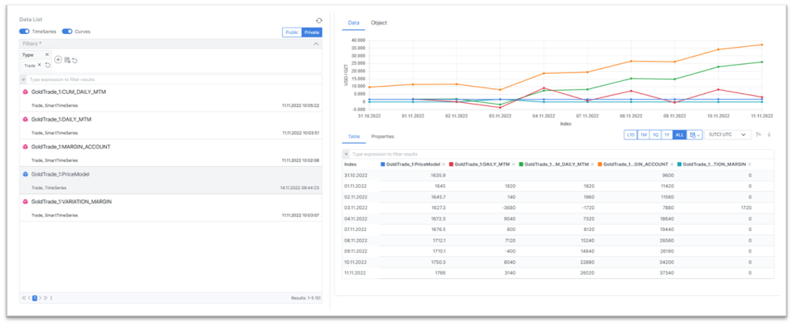
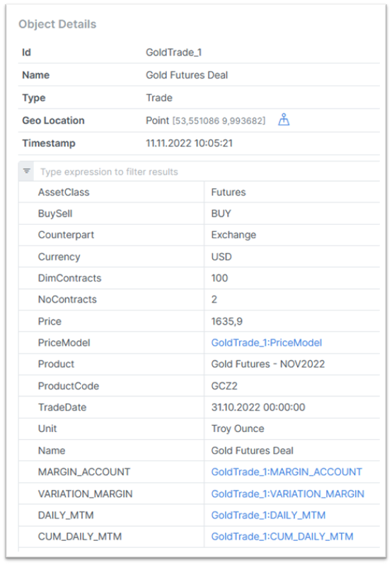
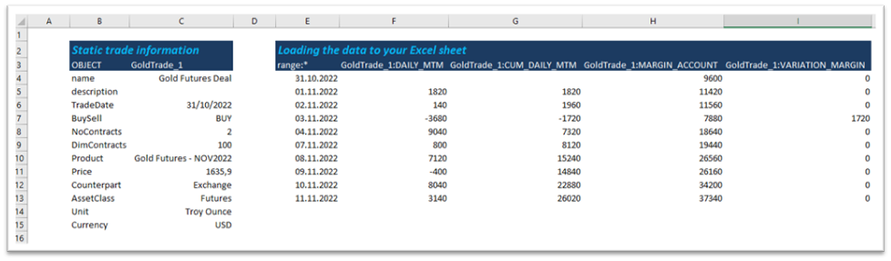
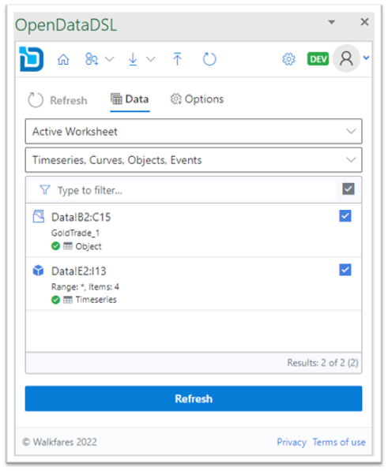

<div className="row">
  <div className="column">
    
  </div>
  <div className="column">
  <h2>Margin Account calculations and configurations in ODSL?</h2>  
    Explore for a Gold futures deal margin acount, what the inputs are, 
	what calculations are required and which data are stored and where?
  </div>
</div>

<!--truncate-->

## Gold futures deal margin acount 

### Inputs
If you run the calculation in Excel, your sheet might look similar as the following with the daily marking-to-market for your position of 200 troy ounces Gold futures Nov-22.
At the top you find the trade information and at the bottom the calculations and output.



Besides specific trade information, an updating price series needs to be defined to run the daily marking-to-market of the trade.
For this example we use [Gold future settlements from CME website] (https://www.cmegroup.com/markets/metals/precious/gold.settlements.html), 
where usually 5 historical days are listed. We loaded the data for testing purpose using the ODSL Excel Addin. 

The CME website provides some spec as well as margins information:
https://www.cmegroup.com/education/courses/introduction-to-futures/margin-know-what-is-needed.html
https://www.cmegroup.com/markets/metals/precious/gold.margins.html

## Business logic and configuration

### Automate the calculation process with smart time series
For the business logic create an ODSL script (here we call it margin-functions.odsl) in Microsoft VSCode 
for easy coding using our DSL (4GL language) to calculate 
* daily MTM, 
* cumulated daily MTM, 
* margin account and 
* variation margin 
stored as smart time series. 

:::info Smart time series
Why smart time series? Because an input feed (BASE input) triggers the 
calculation of the dependend time series. We think this is smart.
:::

An example for the margin account function using the data management specific syntax

```js
function marginAccount(price, initialMargin, maintenanceMargin, ncontracts, contract)
    mtm = diff(price)*ncontracts*contract
    start = mtm.calendar.previous(mtm.start)
    result = TimeSeries(start, "business", initialMargin * ncontracts)
    margin = initialMargin * ncontracts
    variationMargin = 0
    for tv in mtm.values
        margin = margin + tv.value + variationMargin
        result.addValue(margin)
        if margin < maintenanceMargin * ncontracts
            variationMargin = initialMargin * ncontracts - margin
        else
            variationMargin = 0
        end
    next
    marginAccount=result
end
```

### Easily configure the smart time series directly in the WebPortal
Input price data from any datasource - we chose CME data for this example - trigger the calculation process for (cumulated) daily MTM, margin account, variation margin. 
Moreover as soon as daily MTM got calculated it triggers the cumulated daily MTM - simply smart.

Select the appropriate script margin-functions[.odsl] from the list, call the functions with specific input data according to the Excel sheet.
Run a test and save the configuration with just a click.



### Analyse the output in the WebPortal
Put all data next to each other.


The object collects all static data as well as the time series data.


### ...or load them into an Excel Sheet
Pull the static trade and the time series data


The ODSL Excel Addin provides powerful features to load and upload your data



## More information or free trial?
Tell us about your project, and we can let you know how we can help.

Contact us at [info@opendatadsl.com](mailto:info@opendatadsl.com)

## Further Reading
* [What is OpenDataDSL?](https://doc.opendatadsl.com/docs/product/intro)
* [VSCode extension](https://doc.opendatadsl.com/docs/user/vscode)
* [Coding in ODSL](https://doc.opendatadsl.com/docs/odsl)