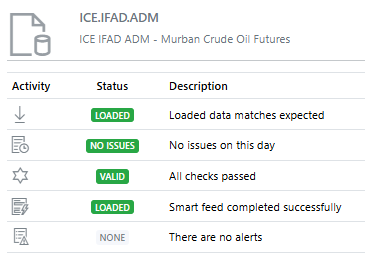

import {Demo} from '/src/components/Forms.js';

  

    
  

  

  <h2>Dataset Monitoring</h2>
  
The latest OpenDataDSL platform release has a major new feature: Dataset Monitoring

  
With Open Data DSL Data Monitoring,  you get unprecedented transparency of your data pipeline with real-time updates and insights for data consumers.
 
  
<b>What is it and why do you need it?</b>
 
  

<!--truncate-->

## Dataset Monitoring in Action
<iframe width="560" height="315" src="https://www.youtube.com/embed/RuVfcidmieU?si=OBr8-Ij-nFPn3XV_" title="YouTube video player" frameborder="0" allow="accelerometer; autoplay; clipboard-write; encrypted-media; gyroscope; picture-in-picture; web-share" referrerpolicy="strict-origin-when-cross-origin" allowfullscreen></iframe>

## What is Dataset Monitoring
**Dataset Monitoring** is a comprehensive tool that provides real-time updates and insights into the data workflow processes for data consumers. 

By defining smart loaders for any dataset, critical data loading time frames, loading priorities, minimum expected data by instrument or tenor, quality and quantity checks and related smart alerts allow you to go far beyond the basics for your daily routine of operational business tasks. 

All operational and technical metrics are stored over time and can easily feed custom Insight reports to give valuable answers to your business around the entire data loading process.
 
**Dataset Monitoring** enhances data quality by identifying inconsistencies, anomalies and problems with incoming data in real time. 
It ensures accurate end to end tracking and allows users to measure the compliance of the data against business standards.

## Why do you need it?
There are 2 main reasons you need Dataset Monitoring from OpenDataDSL:
* **Transparency**
> We collect, load and manage lots of data for our clients which involves dealing with lots of 3rd party data providers who all differ in terms of how they provide the data. 
>
> Dataset Monitoring provides you with a direct view of the information that we generate to manage the data that you use.
* **Control**
> You can also collect and load data yourself, in which case you can use Dataset Monitoring to automatically check your data using your own completeness and quality checks.  

## Major Features

Here is a list of the major features of Dataset Monitoring:

* **Completeness Checks**
> These checks are made after data has been loaded to quantify that all expected data has been loaded.
* **Quality Checks**
> These checks are made on the data values to ensure the quality of the data matches expectations.
* **Smart Loaders**
> In conjunction with the completeness checks, Smart Loaders use AI algorithms to load data in a smarter way.  
* **Alerts**
> Users can subscribe to alerts informing them of late or missing datasets and other detailed information from our data team.
* **Insights**
> Insights are interactive reports that give unique perspectives on all aspects of a dataset. 

### Completeness Checks
Completeness checks ensure that the data loaded for a specific dataset matches what is expected on any specific day.

They can be defined as:
* **Minimum expected tenors**
> A simple count of the number of provided tenors by tenor type as a minimum
* **Custom function**
> You can define custom functions which test specific criteria, e.g. a specific tenor is only provided on a Friday, so test to see that it is there if the current day is Friday.

### Quality Checks
Quality checks test the provided values to ensure they fulfill the criteria you define, example tests are:

* **Zero Check**
> Ensure that the value isn't zero
* **Negative Check**
> Ensure that the value isn't negative
* **Change Check**
> Ensure the new value is within a percentage threshold of the previous value

### Smart Loaders
Smart loaders are a way of collecting data regularly until the completeness checks are fulfilled.
You can specify various retry strategies depending on how time-important the data is.

It uses machine learning to identify any optimisation that can be used to improve the scheduling and loading. 

### Alerts
Alerts are automatically generated when datasets are not complete and they reach a lateness or missing threshold.
Alerts can also be manually generated to give more context regarding the situation with the data provider.

Alerts can be subscribed to and automatically sent to e.g. a Teams channel or create a JIRA support ticket.

### Insights
Insights are reports that are created by us or you that help you answer questions such as:

* How often is a dataset late?
* Who is actively looking at this dataset?
* What dataset configuration has changed recently?
* What days do we expect this dataset to be delivered?
* What tenor types are historically delivered for this dataset?

## Next steps
Do you want to see this in action and see how you can benefit from OpenDataDSL?

Tell us about your project, and we can let you know how we can help.

* Contact us at [info@opendatadsl.com](mailto:info@opendatadsl.com)
* [Sign Up](/SignUp) today and become part of the OpenDataDSL community!
* Fill out the form below, we will contact you to arrange a personally tailored demo.

<Demo />

