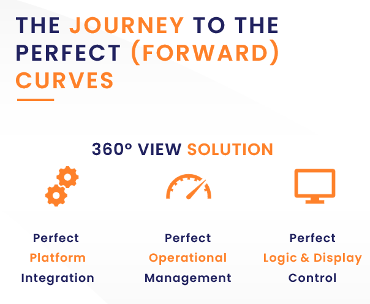

import {Webinar} from '/src/components/Forms.js';

  

    
  

  

  <h4>Journey to the perfect curve</h4>
  <em>Sign up for an hour of discovery where we take you through the entire journey of creating the perfect forward curve</em>
  

<!--truncate-->

## Webinar, 18th September 2024 11:00am (Europe/London)

## Introduction

### What is in the journey to the perfect forward curve?

The journey to the perfect forward curve is interesting but full of potential pitfalls.

In this webinar we define what a forward curve is and why it is important.
We then take you through the steps needed to arrive at the perfect forward curve.
  

:::warning The destination
A forward curve that can be trusted, explained and traced back to raw facts
:::

## View the recorded webinar below

<iframe width="800" height="450" src="https://www.youtube.com/embed/Kb8G94C6Co0?si=FQNHlsNdwAs3rp-5" title="YouTube video player" frameborder="0" allow="accelerometer; autoplay; clipboard-write; encrypted-media; gyroscope; picture-in-picture; web-share" referrerpolicy="strict-origin-when-cross-origin" allowfullscreen></iframe>

